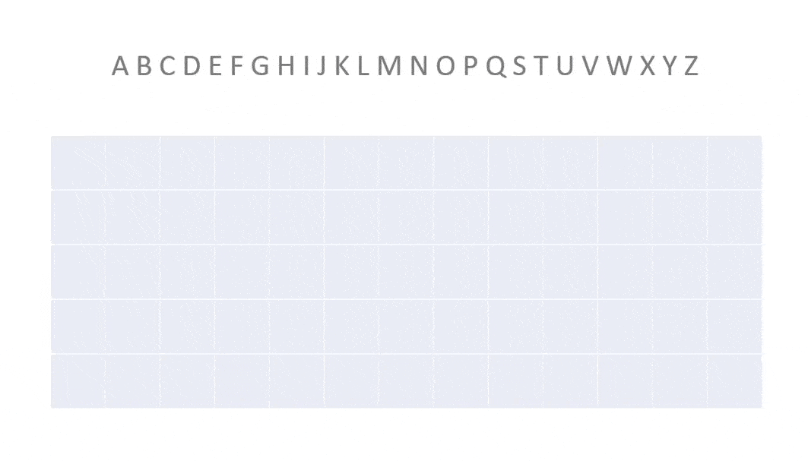
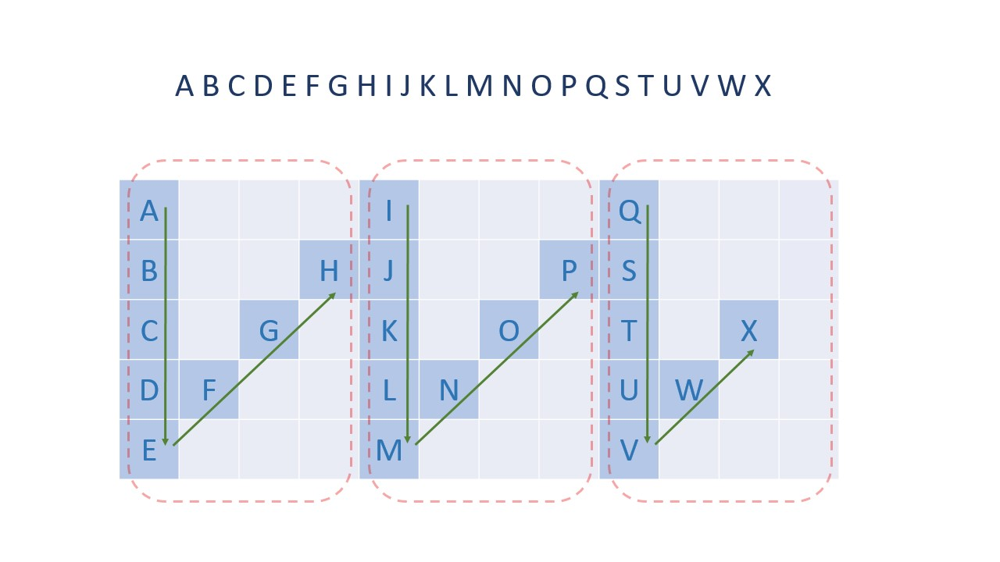
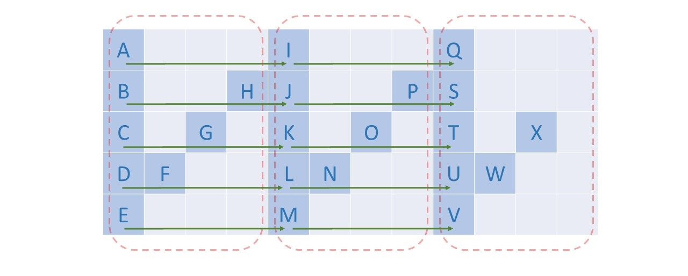
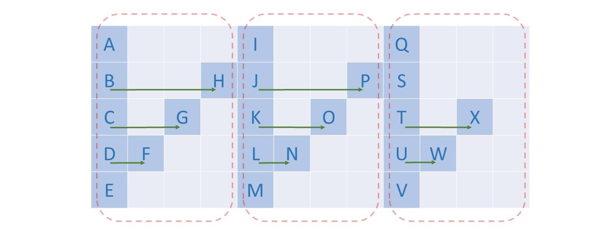
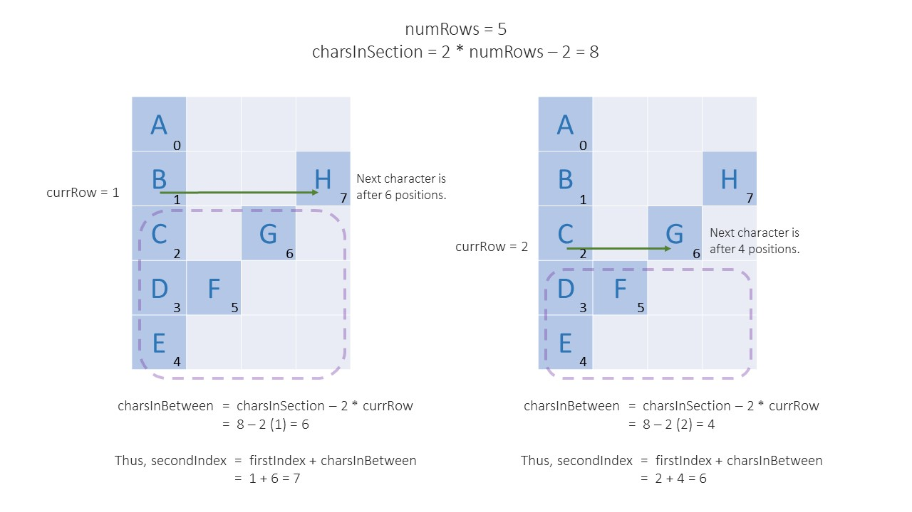

#### Overview

The main focus of this problem is not to check any data structure or algorithm knowledge but to check the thought process and problem-solving ability of the candidate when given a tricky situation.

We need to print the given input string line-by-line after writing it in a zig-zag pattern.


If we have an appropriately sized empty matrix, then we can simulate the zig-zag motion and fill the matrix cells. Then, read the rows line-by-line (leaving spaces) to get the final result.

You might be aware of a popular question [Spiral Matrix](https://leetcode.com/problems/spiral-matrix/), where we need to print matrix elements in spiral order.
In that problem, we can simulate spiral movement. In this problem, we need to simulate the zig-zag movement.

You can get an idea about matrix filling from this animation:



#### Approach 1: Simulate Zig-Zag Movement

**Intuition**

**Our first task is to determine the size of the matrix**, as this will allow us to create a 2d array where we can simulate writing the input string in a zig-zag pattern.

The number of rows of the matrix will be equal to `numRows`. We need to calculate the number of columns we need.
Let's consider a part circled in red (one column, and a diagonal) as one section.


Each section will have at most `numRows - 1` columns in it (the last section might have fewer columns), as can be seen in the above example.

In each section, we will have `2 * numRow - 2` characters, (`numRow` characters in one column and `numRow - 2` in the diagonal).
Thus, for a string of `n` characters, we will require at most `ceil(n / (2 * numRows - 2))` sections, and as each section will have `numRows - 1` columns. We can say we need `ceil(n / (2 * numRows - 2)) * (numRows - 1)` columns.

So, our matrix will be of dimension, `numRows × numCols`, where `numCols = ceil(n / (2 * numRows - 2)) * (numRows - 1)`.

**Our second and more tricky task is to traverse the matrix in a zig-zag order**.

Let's keep two variables `currRow` and `currCol` to represent the current cell of the matrix.
We start from the top, traverse down through an entire column, then traverse diagonally up, i.e. we traverse one section and then repeat the same process again for the next section until the string is finished.



- While moving from top to bottom in a column, `currCol` will remain the same but `currRow` will go from `0` to `numRows`.
- While moving diagonally up, we move one cell up and one cell right, thus increment `currCol` by `1` and decrease `currRow` by `1` till it reaches the top (`currRow=0`)

We repeat this movement until we traverse all `n` characters of the input string.

Now we have filled the matrix, thus **our final task is just to read the matrix line-by-line** (ignoring empty cells).

**Algorithm**

1. Initialize variables:
  - `answer`, an empty string to store the final result.
  - `n`, length of the input string.
  - `numCols`, to store the number of columns in our matrix.
  - `matrix`, a character matrix to store the input string.
  - `currRow`, `currCol`, to represent cells in our matrix.
2. Iterate on each section of the matrix and fill it with characters from the input string.
  - We iterate down in the column, so we increment `currRow` by `1` and keep `currCol` the same. Then, we iterate diagonally up, so we increment `currCol` by `1` and decrease `currRow` by `1`, as discussed previously.
  - While traversing we will fill each `matrix` cell with a character from the input string if there are characters left in it.
3. We iterate on the `matrix` row-wise, and append characters (except spaces) in `answer` string.

4. Return `answer` string.

**Implementation**

<details>
  <summary><b>C++</b></summary>

``` c++
class Solution {
public:
    string convert(string s, int numRows) {
        if (numRows == 1) {
            return s;
        }
        
        int n = int(s.size());
        int sections = ceil(n / (2 * numRows - 2.0));
        int numCols = sections * (numRows - 1);
        
        vector<vector<char>> matrix(numRows, vector<char>(numCols, ' '));
        
        int currRow = 0, currCol = 0;
        int currStringIndex = 0;
        
        // Iterate in zig-zag pattern on matrix and fill it with string characters.
        while (currStringIndex < n) {
            // Move down.
            while (currRow < numRows && currStringIndex < n) {
                matrix[currRow][currCol] = s[currStringIndex];
                currRow++;
                currStringIndex++;
            }
            
            currRow -= 2;
            currCol++;
            
            // Move up (with moving right also).
            while (currRow > 0 && currCol < numCols && currStringIndex < n) {
                matrix[currRow][currCol] = s[currStringIndex];
                currRow--;
                currCol++;
                currStringIndex++;
            }
        }
        
        string answer;
        for (auto& row: matrix) {
            for (auto& character: row) {
                if (character != ' ') {
                    answer += character;
                }
            }
        }
        
        return answer;
    }
};
```
</details>
<details>
  <summary><b>Java</b></summary>

``` java
class Solution {
    public String convert(String s, int numRows) {
        if (numRows == 1) {
            return s;
        }
        
        int n = s.length();
        int sections = (int) Math.ceil(n / (2 * numRows - 2.0));
        int numCols = sections * (numRows - 1);
        
        char[][] matrix = new char[numRows][numCols];
        for (char[] row: matrix) {
            Arrays.fill(row, ' ');
        }
        
        int currRow = 0, currCol = 0;
        int currStringIndex = 0;
        
        // Iterate in zig-zag pattern on matrix and fill it with string characters.
        while (currStringIndex < n) {
            // Move down.
            while (currRow < numRows && currStringIndex < n) {
                matrix[currRow][currCol] = s.charAt(currStringIndex);
                currRow++;
                currStringIndex++;
            }
            
            currRow -= 2;
            currCol++;
            
            // Move up (with moving right also).
            while (currRow > 0 && currCol < numCols && currStringIndex < n) {
                matrix[currRow][currCol] = s.charAt(currStringIndex);
                currRow--;
                currCol++;
                currStringIndex++;
            }
        }
        
        StringBuilder answer = new StringBuilder();
        for (char[] row: matrix) {
            for (char character: row) {
                if (character != ' ') {
                    answer.append(character);
                }
            }
        }
        
        return answer.toString();
    }
}
```
</details>
<details>
  <summary><b>JavaScript</b></summary>

``` js
let convert = function(s, numRows) {
    if (numRows == 1) {
        return s;
    }

    let n = s.length;
    let sections = Math.ceil(n / (2 * numRows - 2.0));
    let numCols = sections * (numRows - 1);

    let matrix = new Array(numRows).fill(0).map(() => new Array(numCols).fill(' '));
    
    let currRow = 0, currCol = 0;
    let currStringIndex = 0;

    // Iterate in zig-zag pattern on matrix and fill it with string characters.
    while (currStringIndex < n) {
        // Move down.
        while (currRow < numRows && currStringIndex < n) {
            matrix[currRow][currCol] = s[currStringIndex];
            currRow++;
            currStringIndex++;
        }

        currRow -= 2;
        currCol++;

        // Move up (with moving right also).
        while (currRow > 0 && currCol < numCols && currStringIndex < n) {
            matrix[currRow][currCol] = s[currStringIndex];
            currRow--;
            currCol++;
            currStringIndex++;
        }
    }

    let answer = matrix.map(row => row.join('')).join('');
    return answer.replaceAll(' ', '');
};
```
</details>
<details>
  <summary><b>Python 3</b></summary>

``` python
class Solution:
    def convert(self, s: str, num_rows: int) -> str:
        if num_rows == 1:
            return s
        
        n = len(s)
        sections = ceil(n / (2 * num_rows - 2.0))
        num_cols = sections * (num_rows - 1)
        
        matrix = [[' '] * num_cols for _ in range(num_rows)]
        
        curr_row, curr_col = 0, 0
        curr_string_index = 0
        
        # Iterate in zig-zag pattern on matrix and fill it with string characters.
        while curr_string_index < n:
            # Move down.
            while curr_row < num_rows and curr_string_index < n:
                matrix[curr_row][curr_col] = s[curr_string_index]
                curr_row += 1
                curr_string_index += 1
                
            curr_row -= 2
            curr_col += 1
            
            # Move up (with moving right also).
            while curr_row > 0 and curr_col < num_cols and curr_string_index < n:
                matrix[curr_row][curr_col] = s[curr_string_index]
                curr_row -= 1
                curr_col += 1
                curr_string_index += 1
        
        answer = ""
        for row in matrix:
            answer += "".join(row)
            
        return answer.replace(" ", "")
```
</details>

**Complexity Analysis**

Here, $n$ is the length of the input string, and $numRows$ is the number of rows of the zig-zag pattern.

- Time complexity: $O(numRows⋅n)$.
  - We initialize an empty 2-dimensional matrix of size $numRows × numCols$, where $O(numCols)=O(n)$. So it takes $O(numRows⋅n)$ time.
  - Then we iterate on the input string, which takes $O(n)$ time, and again traverse on the matrix to generate the final string, which takes $O(numRows⋅n)$ time.
  - Thus, overall we take $O(2(numRows⋅n)+n)=O(numRows⋅n)$ time.
- Space complexity: $O(numRows⋅n)$.
 - We use an additional 2-dimensional array of size $numRows×numCols$, where $O(numCols)=O(n)$.

#### Approach 2: String Traversal

**Intuition**

The previous approach will be accepted, the interviewer doesn't expect us to give this solution but we are listing it as there is still room for some optimization, it can get hard to visualize so we will take it one step at a time so keep the pace with us.

We were storing the string in a zig-zag pattern using some additional space. Look at each row of the completed matrix. If we notice carefully there is a pattern between the distances between characters in each row. If we analyze the jump pattern and traverse the input string using that pattern we can avoid the use of additional space.


In the above image, you can see, (each color denotes one row of our previously traversed matrix when mapping it in input string) in jumps denoted by pink arrows, first, we jump 6 steps then 2, then 6, and then again 2.
Similarly, there is a pattern for all colors. Let's start analyzing this pattern using the same filled matrix.

Notice in the below image the first and last rows we jump to the same position in the next section, i.e. we jump (number of characters) positions in each section.



But in the rest of the rows, we must traverse to the next corresponding element of the same section before jumping to the next section.



The hard part will be to calculate how to jump to the next character.

1. If we have to jump to the next section then it's simple: we only jump charsInSection\text{charsInSection}charsInSection characters.
  So, `currIndex += charsInSection`.

2. If we have to jump to the next character in the same section, then we will have to calculate how many characters are between these two positions and increment `currIndex` by that value.
  If the total characters in a section are `charsInSection` and we are in the i<sup>th</sup> row, then the number of characters above the current row will be `2*i`, and the number of characters left will be `charsInBetween = charsInSection - 2*i`.
  So, `secondIndex = currIndex + charsInBetween`.



Thus, we can iterate over the input string in line-by-line order after writing it in a zig-zag pattern directly.

**Algorithm**

1. Initialize variables:
  - `answer`, an empty string to store the final result.
  - `n`, length of the input string.
  - `charsInSection`, to store the number of characters in each section we defined.
2. Iterate on each row from `numRows`:
  - `index` will start at the first character in the current row, i.e. `index` is equal to `currRow`.
  - We will traverse in the current row and append all characters to the `answer` string. First, we append the first character of the current section. If the current row is not the first or last row then we append the second character of the current section. Then update the index to jump to the next section in the current row and repeat this process again.
3. Return `answer`.

**Implementation**

<details>
  <summary><b>C++</b></summary>

``` c++
class Solution {
public:
    string convert(string s, int numRows) {
        if (numRows == 1) {
            return s;
        }

        string answer;
        int n = s.size();
        int charsInSection = 2 * (numRows - 1);

        for (int currRow = 0; currRow < numRows; ++currRow) {
            int index = currRow;

            while (index < n) {
                answer += s[index];

                // If currRow is not the first or last row
                // then we have to add one more character of current section.
                if (currRow != 0 && currRow != numRows - 1) {
                    int charsInBetween = charsInSection - 2 * currRow;
                    int secondIndex = index + charsInBetween;
                    
                    if (secondIndex < n) {
                        answer += s[secondIndex];
                    }
                }
                // Jump to same row's first character of next section.
                index += charsInSection;
            }
        }

        return answer;
    }
};
```
</details>
<details>
  <summary><b>Java</b></summary>

``` java
class Solution {
    public String convert(String s, int numRows) {
        if (numRows == 1) {
            return s;
        }
        
        StringBuilder answer = new StringBuilder();
        int n = s.length();
        int charsInSection = 2 * (numRows - 1);
        
        for (int currRow = 0; currRow < numRows; ++currRow) {
            int index = currRow;

            while (index < n) {
                answer.append(s.charAt(index));

                // If currRow is not the first or last row
                // then we have to add one more character of current section.
                if (currRow != 0 && currRow != numRows - 1) {
                    int charsInBetween = charsInSection - 2 * currRow;
                    int secondIndex = index + charsInBetween;
                    
                    if (secondIndex < n) {
                        answer.append(s.charAt(secondIndex));
                    }
                }
                // Jump to same row's first character of next section.
                index += charsInSection;
            }
        }
        
        return answer.toString();
    }
}
```
</details>
<details>
  <summary><b>JavaScript</b></summary>

``` js
let convert = function(s, numRows) {
    if (numRows == 1) {
        return s;
    }

    let answer = "";
    let n = s.length;
    let charsInSection = 2 * (numRows - 1);
    
    for (let currRow = 0; currRow < numRows; ++currRow) {
        let index = currRow;

        while (index < n) {
            answer += s[index];

            // If current row is not first or last,
            // then we have to add one more character of current section.
            if (currRow != 0 && currRow != numRows - 1) {
                let charsInBetween = charsInSection - 2 * currRow;
                let secondIndex = index + charsInBetween;

                if (secondIndex < n) {
                    answer += s[secondIndex];
                }
            }
            // Jump to same row's first character of next section.
            index += charsInSection;
        }
    }
    
    return answer;
};
```
</details>
<details>
  <summary><b>Python 3</b></summary>

``` python
class Solution:
    def convert(self, s: str, numRows: int) -> str:
        if numRows == 1:
            return s
        
        answer = []
        n = len(s)
        chars_in_section = 2 * (numRows - 1)

        for curr_row in range(numRows):
            index = curr_row
            while index < n:
                answer.append(s[index])

                # If curr_row is not the first or last row,
                # then we have to add one more character of current section.
                if curr_row != 0 and curr_row != numRows - 1:
                    chars_in_between = chars_in_section - 2 * curr_row
                    second_index = index + chars_in_between
                    
                    if second_index < n:
                        answer.append(s[second_index])
                # Jump to same row's first character of next section.
                index += chars_in_section
                
        return "".join(answer)
```
</details>

**Complexity Analysis**

Here, $n$ is the length of the input string.

- Time complexity: $O(n)$.
  - We iterate over each index of the input only once and perform constant work at each index.
- Space complexity: $O(1)$.
  - We have not used any additional space other than for building the output, which is not counted.