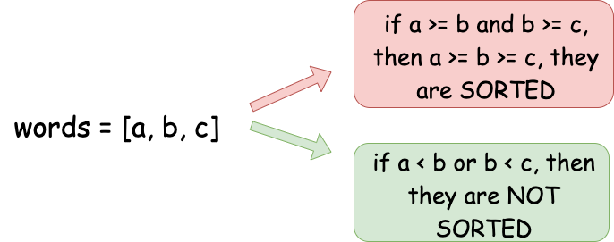

#### Overview

To check if the given `words` are sorted, for each word we need to check if every word on its right is lexicographically larger. Likewise, for each word we could check if every word on its left is lexicographically smaller. That said, we don't need to compare every word to all of the words to its right. Instead, we can just compare each pair of adjacent words. If all pairs of adjacent words are sorted, then we can safely conclude that `words` is sorted. Furthermore, if any pair of adjacent `words` is not sorted, then we know that words is not sorted.


*Figure 1. Compare adjacent words.*

#### Approach 1: Compare adjacent words

**Intuition**

Following the above overview, we want to compare each pair of adjacent words to see if they are sorted lexicographically. This can be achieved by a naive for-loop iterating over the input array. We can store the `letter-order` relation of each letter with its ranking in `order`, so that we can easily access the order of letters when we compare them.

The remaining piece of the puzzle is how to compare two words lexicographically. This is not difficult, but there are a few edge cases that we must consider. To compare two adjacent words `words[i]` and `words[i+1]`, we want to find the first letter that is different: if `words[i]` has the lexicographically smaller letter, then we can exit from the iteration because we know `words[i]` and `words[i+1]` are in the right order; however, if `words[i]` has the lexicographically larger letter, then we immediately return `false`, because we found one pair of words that are in the wrong order.

We also need to consider the boundaries. While we loop from the beginning to the end of one word, we need to check if the other word has ended. Take the words `apple` and `app` as an example, we cannot iterate over all of the letters in `apple` because the word `app` is shorter. In this case, we reach the end of one word before finding the first different letter. When this happens, we must examine the length of each word: if the words are the same length or the former word is shorter, then `words` is sorted. However, if the latter word is shorter, then `words` is not sorted.

**Algorithm**

- Initialize a hashmap/array to record the relations between each letter and its ranking in `order`.
- Iterate over `words` and compare each pair of adjacent words.
  - Iterate over each letter to find the first different letter between `words[i]` and `words[i + 1]`.
    - If `words[i + 1]` ends before `words[i]` and no different letters are found, then we need to return `false` because `words[i + 1]` should come before `words[i]` (for example, `apple` and `app`).
    - If we find the first different letter and the two words are in the correct order, then we can exit from the current iteration and proceed to the next pair of words.
    - If we find the first different letter and the two words are in the wrong order, then we can safely return false.
- If we reach this point, it means that we have examined all pairs of adjacent words and that they are all sorted. Therefore we can return true.

<details>
  <summary><b>Java</b></summary>

``` java
class Solution {
class Solution {
    public boolean isAlienSorted(String[] words, String order) {
        int[] orderMap = new int[26];
        for (int i = 0; i < order.length(); i++){
            orderMap[order.charAt(i) - 'a'] = i;
        }

        for (int i = 0; i < words.length - 1; i++) {

            for (int j = 0; j < words[i].length(); j++) {
                // If we do not find a mismatch letter between words[i] and words[i + 1],
                // we need to examine the case when words are like ("apple", "app").
                if (j >= words[i + 1].length()) return false;

                if (words[i].charAt(j) != words[i + 1].charAt(j)) {
int currentWordChar = words[i].charAt(j) - 'a';
int nextWordChar = words[i + 1].charAt(j) - 'a';
                    if (orderMap[currentWordChar] > orderMap[nextWordChar]) return false;
                    // if we find the first different letter and they are sorted,
                    // then there's no need to check remaining letters
                    else break;
                }
            }
        }

        return true;
    }
}
```
</details>
<details>
  <summary><b>Python 3</b></summary>

``` python
class Solution:
    def isAlienSorted(self, words: List[str], order: str) -> bool:
        order_map = {}
        for index, val in enumerate(order):
            order_map[val] = index

        for i in range(len(words) - 1):

            for j in range(len(words[i])):
                # If we do not find a mismatch letter between words[i] and words[i + 1],
                # we need to examine the case when words are like ("apple", "app").
                if j >= len(words[i + 1]): return False

                if words[i][j] != words[i + 1][j]:
                    if order_map[words[i][j]] > order_map[words[i + 1][j]]: return False
                    # if we find the first different character and they are sorted,
                    # then there's no need to check remaining letters
                    break

        return True
```
</details>

**Complexity analysis**

Let $N$ be the length of `order`, and $M$ be the total number of characters in `words`.

- Time complexity: $O(M)$.

  Storing the `letter-order` relation of each letter takes $O(N)$ time. For the nested for-loops, we examine each pair of words in the outer-loop and for the inner loop, we check each letter in the current word. Therefore, we will iterate over all of letters in `words`.

  Taking both into consideration, the time complexity is $O(M+N)$. However, we know that $N$ is fixed as $26$. Therefore, the time complexity is $O(M)$.

- Space complexity : $O(1)$. The only extra data structure we use is the hashmap/array that serves to store the `letter-order` relations for each word in `order`. Because the length of `order` is fixed as $26$, this approach achieves constant space complexity.